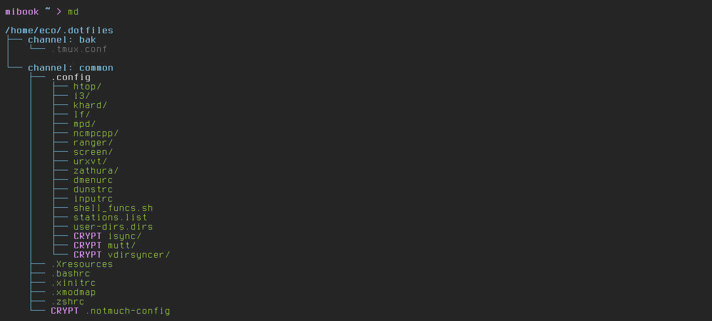

# Microdot :: a colorful dotfiles manager



## Features
- **Channels:** Dotfiles are organized in channels. You can keep channels with sets of dotfiles for separate computers. Or keep sets of common dotfiles that are shared between computers.  
- **Encryption:** Dotfiles can be encrypted individually. An optional daemon can watch the unencrypted dotfile for changes and automatically keep the encrypted file up to date.
- **Git sync:** The daemon can optionally sync to a git repo to keep all your computers in sync.
- **Conflict resolution:** If a sync conflict occurs between encrypted files, microdot helps you to merge the files/dirs together.

## Dependencies
- [Cryptography](https://cryptography.io)
- [GitPython](https://github.com/gitpython-developers/GitPython)

## Usage

    usage: microdot [OPTIONS]

    Gotta manage them dotfiles

    options:
      -h, --help                              show this help message and exit
      -l DOTFILE, --link DOTFILE              link dotfile
      -L, --link-all                          link all dotfiles in channel
      -u DOTFILE, --unlink DOTFILE            unlink dotfile
      -U, --unlink-all                        unlink all dotfiles in channel
      -i PATH, --init PATH                    start using dotfile with microdot
      -x DOTFILE, --to-decrypted DOTFILE      decrypt an already encrypted file
      -E DOTFILE, --to-encrypted DOTFILE      encrypt an already initiated dotfile
      -s, --sync                              sync/update decrypted with encrypted dotfiles
      -w, --watch                             same as --sync but as a daemon
      -C CONFLICT, --solve-conflict CONFLICT  solve conflict by manual merging
      -g, --use-git                           use together with --sync|--watch to sync repo with git
      -e, --encrypt                           use together with --init to encrypt file
      -c NAME, --channel NAME                 specify the channel to use
      -d DIR, --dotfiles-dir DIR              specify the dotfiles directory
      -y, --assume-yes                        assume yes to questions
      -f, --force                             force overwrite files/dirs
      -D, --debug                             enable debugging

### Start using (init) a dotfile:

    # not specifying a channel defaults to the "common" channel
    $ md --init ~/.config/dotfile.txt

    # init file and place in my_hostname channel
    $ md --channel my_hostname --init ~/.config/dotfile.txt

Same, but use encryption this time:

    $ md --encrypt --init ~/.config/dotfile.txt

This would result in a directory structure similar to this:

    ~/.dotfiles
    ├── common
    │   └── .config
    │       └── dotfile.txt#vWHbAUqC#20220126212324#F#CRYPT
    ├── decrypted
    │   └── common
    │       └── .config
    │           └── dotfile.txt
    ├── .git
    └── .gitignore

where: 

- the encrypted file is at: ```~/.dotfiles/common/.config/dotfile.txt#vWHbAUqC#20220126212324#F#CRYPT```
- the unencrypted file is at: ```~/.dotfiles/decrypted/common/.config/dotfile.txt```

### Link and unlink an initialized dotfile:

    # when initialized you only have to specify the path relative to the home directory
    $ md --link .config/dotfile.txt
    $ md --unlink .config/dotfile.txt

### Link and unlink all dotfiles in a channel:

    # not specifying a channel defaults to the "common" channel
    $ md --link-all
    $ md --unlink-all

    # link all dotfile in the my_hostname channel
    $ md --link-all --channel my_hostname
    $ md --unlink-all --channel my_hostname

### Encrypt and decrypt an already initialized dotfile

    $ md --to-encrypted  .config/dotfile.txt
    $ md --to-decrypted  .config/dotfile.txt

### List all files managed by microdot

    $ md

## Syncing of encrypted dotfiles
On first run a config file containing the encryption key is created at: ```$XDG_CONFIG_HOME/microdot/microdot.conf```.  
When linking an initiated encrypted dotfile a lot of things happen behind the scenes:

- dotfile is decrypted to the "decrypted" directory in the root of the dotfiles directory.
- a link is created from the original dotfile location to the decrypted location.
- a .gitignore file is created with the "decrypted" directory blacklisted to prevent microdot from syncing your decrypted files to git.

Microdot contains a daemon to keep the decrypted and encrypted versions of the dotfile in sync.  
When a change is detected in the decrypted version, the daemon will re-encrypt the file.  

    # do a sync when changes are detected
    $ md --sync

    # same as --sync but keep running as a daemon
    $ md --watch

Microdot can additionally sync with an external git repo.  
Git can only solve conflicts for text files.  
Because encrypted files are binary, git is not able to solve these conflicts.  
To fix this problem Microdot adds a sync layer on top of git to identify new versions and choose which version is the newest.  

    $ md --sync --use-git

    # or as a daemon:
    $ md --watch --use-git

In the case of a conflict, a conflict file is created in the same directory as where the encrypted file is located.  

    ~/.dotfiles
    ├── common
    │   └── .config
    │       ├── dotfile.txt#dXQ3o9K1#20220121181309#F#CRYPT#CONFLICT
    │       └── dotfile.txt#vWHbAUqC#20220126212324#F#CRYPT
    ├── decrypted
    │   └── common
    │       └── .config
    │           └── dotfile.txt
    ├── .git
    └── .gitignore

Microdot can help to solve the conflict:

    $ md --solve-conflict .config/dotfile.txt#dXQ3o9K1#20220121181309#F#CRYPT#CONFLICT

## ZSH command completion
A completion file is located in the repository at: `completion/zsh/_microdot`.  
To use this file, you have to copy the file to a directory in your $fpath.  
On my system the completion files are found at:

    /usr/share/zsh/site-functions/*

Alternatively you can add the completion directory to your $fpath by adding the following line to your `~/.zshrc`:

    # edit path to point to the location of the completion dir
    fpath=(~/path/to/repo/completion/zsh $fpath)


## Note on directory structure
To properly link the dotfiles and dirs, microdot  needs to know how to interpret the directory structure.  
The directory structure below can be seen as either:  
one dotdir: `.config`  
or:  
two dotdirs: `.config/dotdir1` and `.config/dotdir2`

    dotfiles
    └── .config
        ├── dir1
        ├── dir2
        └── testfile1.txt

To make the distinction, microdot places a special file.  
This file is automatically placed in the directory when added to microdot.  

    dotfiles
    └── .config
        ├── dir1
        ├── dir2
        ├── .microdot <-- special file
        └── testfile1.txt

    # In this case, the `.config` directory is treated as one dotdir.  


    dotfiles
    └── .config
        ├── dir1
        │   └── .microdot <-- special file
        ├── dir2
        │   └── .microdot <-- special file
        └── testfile1.txt

    # In this case microdot treats the stucture as:
    - dotdir:  .config/dir1
    - dotdir:  .config/dir2
    - dotfile: .config/testfile1.txt


## Sync algorithm
Sync algorithm is based on [this](https://unterwaditzer.net/2016/sync-algorithm.html) article by [Markus Unterwaditzer](https://unterwaditzer.net/)
TODO: describe the sync algorithm
